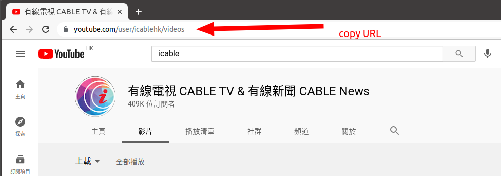

# To get list of all videos on youtube:

## Instructions

1. Install [youtube-dl](https://github.com/ytdl-org/youtube-dl)
2. Go to the Youtube channel you want to get video list from. Then click on "Videos" / 影片. 

3. Copy the link/URL

4. Paste the URL to the command below, where it says `<paste YT channel URL here>`. 

`youtube-dl --get-filename -o "%(upload_date)s;;;;;%(view_count)s;;;;;%(id)s;;;;;%(title)s" "<paste YT channel URL here>" > playlist.csv`

**Example:** `youtube-dl --get-filename -o "%(upload_date)s;;;;;%(view_count)s;;;;;%(id)s;;;;;%(title)s" "https://www.youtube.com/user/icablehk/videos" > playlist.csv`

5. Run command in Command Prompt or Terminal. A `playlist.csv` file with list of videos will be created, in the folder you are running command prompt/terminal in (you can change this folder using [`cd` in Command Prompt/Terminal](#other-tutorials-其他教學)).
  
### Remarks
* **With an ID: To view the Youtube video, do: `https://www.youtube.com/watch?v=[id]`. Example: `https://www.youtube.com/watch?v=vVOk7oIKOts`**
* You can also get other metadatas too (url, timestamp, like_count, etc), see: https://github.com/ytdl-org/youtube-dl#output-template
* Recommend to use 5 semicolons `;;;;;` instead of 1 comma ` , ` to separate/delimit the csv file, as many youtube videos have comma ` , ` or 1 semicolon ` ; `. This means if you use 1 comma or semicolon to delimit, the delimiting will be wrong.

## Other tutorials 其他教學 

* [Command Prompt 教學](https://shaochien.gitbooks.io/command-line-and-environment-variable-tutorial/content/command-line.html)
